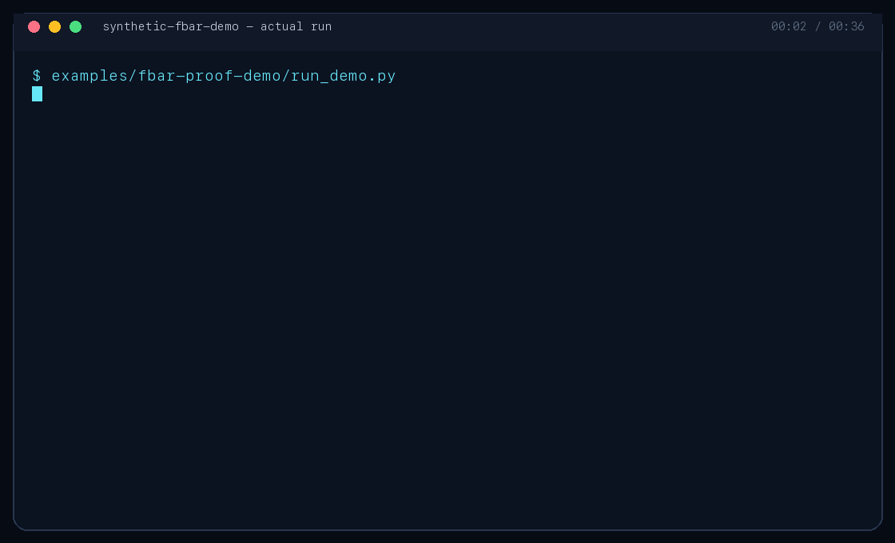
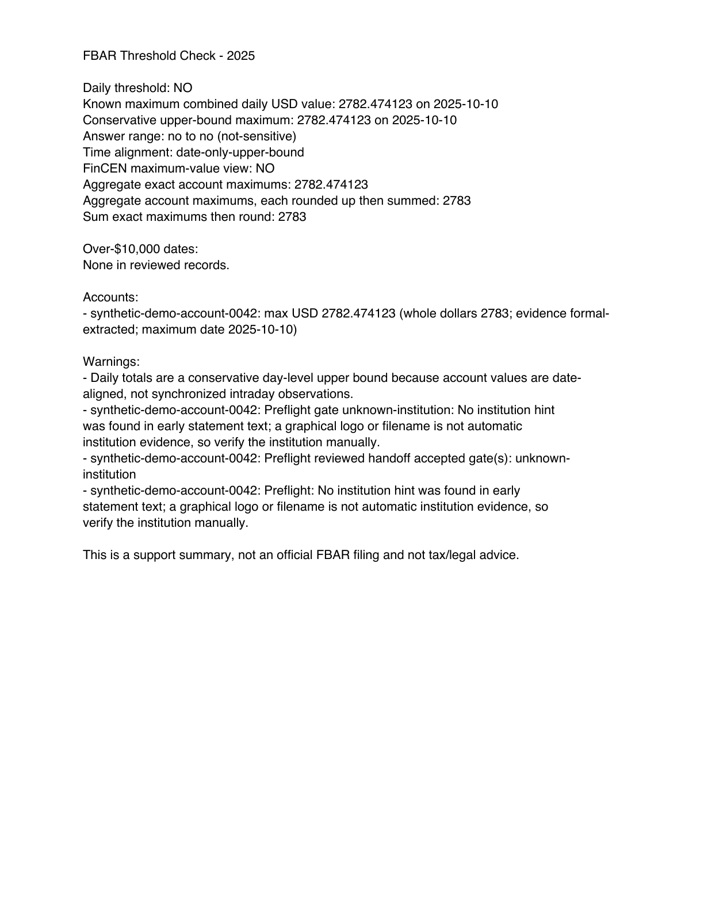
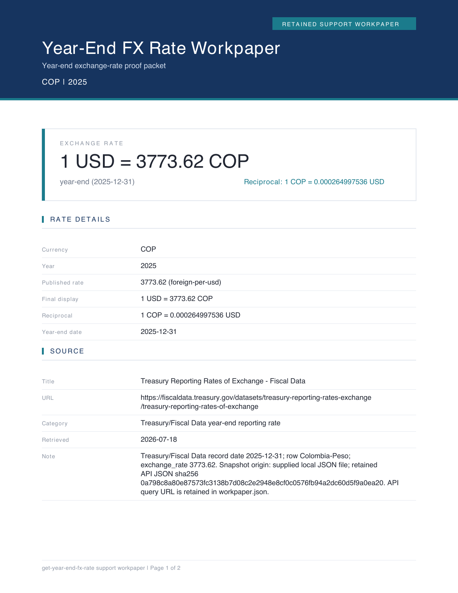

# FBAR Proof Kit by Skills To Pay The Bills

[](https://github.com/zztimur/skills-to-pay-the-bills/actions/workflows/skill-ci.yml)
[](#install-the-kit)
[](https://github.com/zztimur/skills-to-pay-the-bills/releases/latest)
[](https://www.python.org/)
[](LICENSE)

> Turn machine-readable foreign-bank statements into a local, source-linked,
> review-ready FBAR threshold support packet.

**[Run the demo](#run-the-demo)** · **[Install the kit](#install-the-kit)** ·
**[See the sample packet](docs/assets/demo/fbar-proof-summary.pdf)**



The kit chains three focused Agent Skills: statement intake preflight, retained
year-end Treasury FX proof, and an FBAR threshold check. Statement parsing and
packet generation stay on your machine. The included demo uses only invented
statements and a frozen public Treasury response, so you can inspect the whole
workflow without sharing data or making a network request.

This is support software, not tax or legal advice. It does not prepare or file
FinCEN Form 114 and does not decide every filing obligation. See
[DISCLAIMER.md](DISCLAIMER.md).

## See the proof, including the refusal

| Review artifact | What it establishes |
| --- | --- |
|  | A one-page JSON/CSV/PDF-backed threshold summary from a reviewed 365-day ledger, sealed by a portable postflight manifest. |
|  | The exact year-end rate, source URL, date, reciprocal, retained response, and provenance. |

The happy path processes four fictional quarterly COP statements and retains a
reviewed packet. The refusal path omits Q2 and proves the workflow returns
`insufficient-records` / `not-determinable` and refuses ledger confirmation. It
does not manufacture a confident annual answer from incomplete evidence.

Readable-but-unsupported layouts are reported as parser coverage defects rather
than missing data. Reviewed evidence stays visibly classified as formal
extraction, diagnostic reconstruction, or user/preparer attestation. If an
annual maximum has no known date, the result remains an explicit lower/upper
interval instead of inventing a day.

The diagnostic reconstruction lane supports separate Debit/Credit columns and
single explicitly signed Amount/Valor/Monto columns, including equal
opening/closing zero-activity periods. Unsigned movements and unreconciled
checkpoints fail closed.

## Install the kit

### Universal Agent Skills CLI

```bash
npx skills add zztimur/skills-to-pay-the-bills \
  --skill statement-intake-preflight \
  --skill get-year-end-fx-rate \
  --skill fbar-threshold-check
```

The [`skills` CLI](https://www.skills.sh/docs/cli) discovers all six public root
skills in this repository. By default, that third-party CLI sends anonymous
install telemetry used by the skills.sh leaderboard. This project receives no
statement data or first-party telemetry. Opt out before installing with:

```bash
DISABLE_TELEMETRY=1 npx skills add zztimur/skills-to-pay-the-bills \
  --skill statement-intake-preflight \
  --skill get-year-end-fx-rate \
  --skill fbar-threshold-check
```

For a telemetry-free, inspect-before-install path, download the versioned skill
or `fbar-proof-kit` ZIP and `SHA256SUMS` from the
[latest GitHub Release](https://github.com/zztimur/skills-to-pay-the-bills/releases/latest).

### Native Codex plugin

```bash
codex plugin marketplace add zztimur/skills-to-pay-the-bills
codex plugin add fbar-proof-kit@skills-to-pay-the-bills
```

### Native Claude Code plugin

```text
/plugin marketplace add zztimur/skills-to-pay-the-bills
/plugin install fbar-proof-kit@skills-to-pay-the-bills
```

The native `fbar-proof-kit` bundle contains exactly the same three canonical
skills named above. The top-level skill folders remain the source of truth; a
deterministic sync check prevents the bundled copies from drifting.

## Compatibility

FBAR Proof Kit runs through an Agent Skills-compatible host, not through a
model alone. The host must be able to load `SKILL.md` instructions, read local
files, run Python 3.11–3.13 and shell commands, preserve artifact paths, and
pause at human review gates.

| Agent host | Model guidance | Current status |
| --- | --- | --- |
| [Codex](https://developers.openai.com/codex/models/) | Use the current recommended Codex default; prefer the strongest available reasoning model for ambiguous statement review. | Native plugin package available; model-level validation pending. |
| [Claude Code](https://code.claude.com/docs/en/model-config) | Use `sonnet` for the synthetic demo and routine runs; prefer `opus` for ambiguous statement review. | Native plugin package available; model-level validation pending. |
| [Qwen Code](https://qwenlm.github.io/qwen-code-docs/en/users/features/skills/) | Use its current tool-capable default. | Agent Skills-compatible format; validation pending. |
| [Kimi Code CLI](https://moonshotai.github.io/kimi-cli/en/customization/skills.html) | Use its current managed default. | Agent Skills-compatible format; validation pending. |
| Other hosts and models | Use only a tool-capable model in a host with Agent Skills, local-file, Python, and shell support. | Unverified. |

No individual model or provider is certified by this project. A host/model
combination is considered verified only after it passes both the complete
synthetic workflow and the missing-quarter refusal workflow in a clean session.
Local script execution also does not determine a model provider's data-handling
policy; use only synthetic data while evaluating an unverified host.

## Run the demo

From a clone of this repository:

```bash
git submodule update --init --recursive
python3 -m pip install pdfplumber reportlab pillow
examples/fbar-proof-demo/run_demo.py
```

The run produces:

- four conspicuously synthetic, machine-readable quarterly statement PDFs;
- preflight JSON/CSV and a source-bound reviewed handoff;
- a 365-row account ledger plus explicit review record;
- a frozen Treasury/Fiscal Data response and year-end FX workpaper;
- final threshold JSON, CSV, PDF, and portable postflight verification;
- a missing-quarter refusal record, transcript, and SHA-256 manifest.

Read the [demo guide](examples/fbar-proof-demo/README.md), inspect the
[retained artifacts](examples/fbar-proof-demo/artifacts/), or run the CI-safe
scratch check:

```bash
examples/fbar-proof-demo/run_demo.py --check
```

## Explore individual skills

Try [Privacy Gate and year-end FX evidence](docs/launch/skill-pitches.md) independently,
or inspect [three reproducible demonstrations](docs/launch/demos/README.md).
Read [how the workflow retains evidence and handles missing records](docs/launch/article.md).

## How the proof workflow works

1. `statement-intake-preflight` checks text layers, year and statement-period
   coverage, currency, account grouping, institution evidence, and review gates.
2. A human reviews the flagged assumptions and creates a source-bound handoff.
3. `fbar-threshold-check` extracts or reconstructs reviewed account evidence;
   parser defects remain visible and attested evidence never becomes formal.
4. `get-year-end-fx-rate` retains the applicable public Treasury/Fiscal Data
   response, rate interpretation, reciprocal, source hash, and PDF workpaper.
5. The reviewed ledgers and retained FX proof produce interval-aware JSON, CSV,
   and PDF views, then a portable postflight manifest binds and recomputes the
   exact retained packet.

FBAR schema 1.4 and preflight schema 1.3 are additive. Safe schema 1.2 preflight
handoffs and schema 1.3 confirmed ledgers remain readable, but stale or
precision-unsafe artifacts must be regenerated. CSV consumers should select
columns by header because interval and evidence fields add columns.

## Data boundary

- Statement parsing, review files, ledgers, and summary generation run locally.
- A live year-end FX lookup contacts only public government sources. The
  committed demo uses a frozen response and makes no network request.
- The project has no hosted uploader and collects no first-party telemetry.
- The optional `skills` installer has its own disclosed anonymous install
  telemetry; `DISABLE_TELEMETRY=1` or release ZIPs avoid it.
- Never attach, email, DM, or paste raw bank statements into an issue,
  Discussion, support request, demo, or contribution. Use only synthetic data.

See [PRIVACY.md](PRIVACY.md) and [SECURITY.md](SECURITY.md) for the complete
reporting boundary.

## What is included

This repository includes six public, installable root skills:

| Skill | Purpose |
| --- | --- |
| [`statement-intake-preflight`](statement-intake-preflight/) | Gate machine-readable statement sets before downstream extraction. |
| [`get-year-end-fx-rate`](get-year-end-fx-rate/) | Retain a source-linked year-end USD FX workpaper for FBAR-style conversion. |
| [`fbar-threshold-check`](fbar-threshold-check/) | Build reviewed account ledgers and threshold support artifacts. |
| [`get-yearly-fx-rate`](get-yearly-fx-rate/) | Retain a published yearly-average FX workpaper for income-tax support. |
| [`statements-to-interest`](statements-to-interest/) | Extract reviewed foreign-bank interest support after preflight. |
| [`privacy-gate`](privacy-gate/) | Block secrets, private data, and unsafe exports before publishing. |

[`skill-forge`](https://github.com/zztimur/skill-forge) is a separate companion
project linked here as a submodule. It audits and pressure-tests Agent Skills;
it is not one of the six root skills and is not inside the FBAR Proof Kit bundle.

[`workpaper-kit`](workpaper-kit/) is internal shared rendering code, not an
invokable skill. Its vendored copies are synchronized and hash-checked so every
standalone package remains portable.

## Scope guardrails

The project does not provide a hosted statement uploader, OCR service, Form 114
filing flow, delinquent-filing guidance, or Form 8938 determination. It never
claims IRS approval, guaranteed compliance, penalty avoidance, or an
"audit-proof" result. Public examples use fictional institutions and synthetic
identifiers only.

Official filing scope, thresholds, and deadlines can change. Check current
[IRS FBAR guidance](https://www.irs.gov/businesses/small-businesses-self-employed/report-of-foreign-bank-and-financial-accounts-fbar)
and obtain qualified advice for your facts.

## Roadmap and contributing

Near-term work stays focused on:

- making installation and the fictional demo easier to complete unaided;
- validating compatibility across additional agent hosts and model defaults;
- adding wholly synthetic statement layouts when they expose a reproducible gap;
- incorporating practitioner review without collecting private financial records.

Contributions must use synthetic fixtures. See [CONTRIBUTING.md](CONTRIBUTING.md)
before opening an issue or pull request, and never submit raw statements.
Security problems belong in the private process described in
[SECURITY.md](SECURITY.md).

## Maintainer release gate

CI tests Python 3.11, 3.12, and 3.13. It runs the official Agent Skills
reference validator, strict Skill Forge package inspection, plugin-bundle drift
checks, privacy scans, deterministic unit/integration suites, happy/refusal demo
assertions, and PDF generation tests.

Install the release-gate dependencies in an isolated Python environment:

```bash
python3 -m pip install pdfplumber reportlab pypdf pillow \
  'git+https://github.com/agentskills/agentskills.git@38a2ff82958afee88dadf4831509e6f7e9d8ef4e#subdirectory=skills-ref'
```

The repository has one release stream. `VERSION` and [CHANGELOG.md](CHANGELOG.md)
define each `vX.Y.Z` release. Tags publish deterministic ZIPs for every public
skill and the native plugin plus `SHA256SUMS`. The repository gate scans the
complete proposed Git index; generated filesystem exports retain their own
artifact/package verification. Before a release:

```bash
scripts/release-diff.sh
scripts/release-repo.sh --dry-run minor
```

See [CONTRIBUTING.md](CONTRIBUTING.md) for dependency setup and exact validation
commands.

## License

MIT. See [LICENSE](LICENSE).
