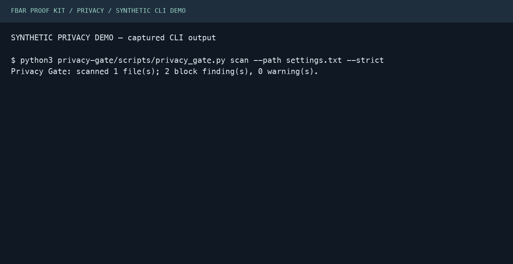
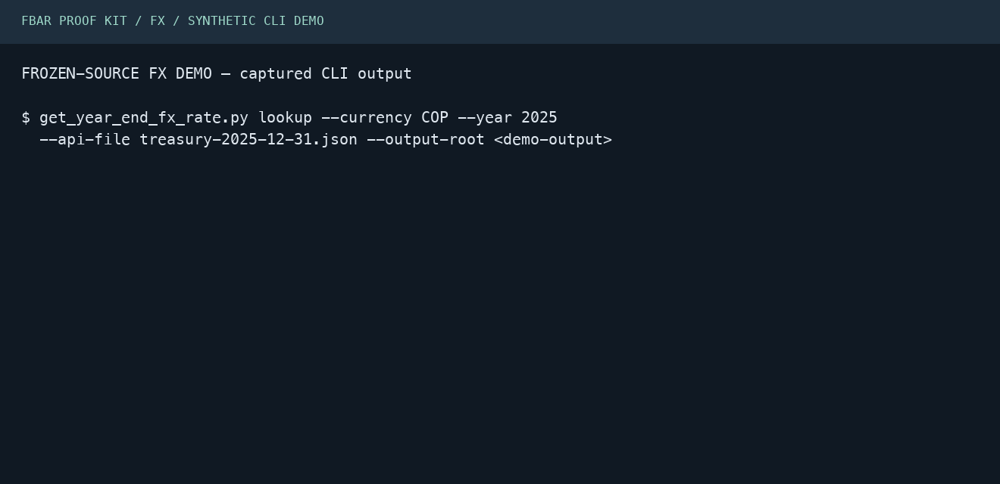

# Three demonstration packages

The bank statements and credential fixture are fictional; the FX response is retained public Treasury data. The privacy and FX animations present captured CLI transcripts; they are not recordings of an agent operating a host. The existing FBAR media is reused from the repository.

## Missing quarter

**Caption:** Four fictional quarters produce a review packet. Remove Q2 and ledger confirmation stops.


[Static alternative](../../assets/demo/fbar-proof-demo-terminal-poster.png) · [Full reproducible guide](../../../examples/fbar-proof-demo/README.md)

Fresh verification: `python3 examples/fbar-proof-demo/run_demo.py --check --skip-media` passed. This tests the script workflow and committed artifact contract, not model compliance.

## Privacy check

**Caption:** A synthetic credential assignment blocks. Remove it and this fixture passes. Real exposed credentials must also be rotated.



[Static transcript view](privacy-demo.png) · [Captured output](privacy-transcript.txt)

Reproduce from the repository root with Python installed:

```bash
python3 docs/launch/demos/reproduce_privacy.py
```

The script constructs a deliberately fake credential in a temporary directory, calls the actual bundled Python scanner, removes the assignment, and reruns. It asserts exit 1 followed by exit 0 and deletes the temporary fixture. Transcript commands abbreviate only the temporary fixture path. No real credential is used.

## FX workpaper

**Caption:** Replay a retained Treasury response and produce a source-backed workpaper. This example uses a frozen source, not a live lookup.



[Static transcript view](fx-demo.png) · [Captured output](fx-transcript.txt) · [Existing sample PDF preview](../../assets/demo/fbar-fx-proof-page-1.png)

Reproduce from the repository root with Python and ReportLab installed:

```bash
python3 get-year-end-fx-rate/scripts/get_year_end_fx_rate.py lookup \
  --currency COP --year 2025 \
  --api-file get-year-end-fx-rate/tests/fixtures/treasury-2025-12-31.json \
  --output-root /tmp/fx-proof-demo
```

The successful CLI exit and workpaper JSON existence were verified. Source retention is demonstrated; no tax result or live-source freshness is asserted.
